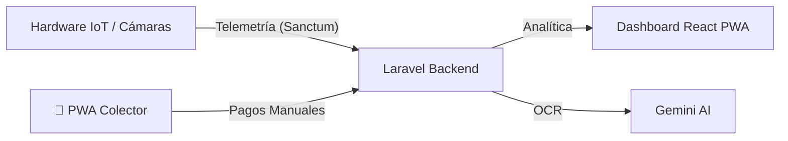

# 🚍 SIMCI-TU: Sistema de Administración de Transporte Urbano


**SIMCI-TU** es una plataforma administrativa de vanguardia diseñada para la gestión integral de flotas de transporte público. Combina telemetría IoT en tiempo real, inteligencia artificial para la validación de pagos y un robusto motor de análisis de negocios (BI).

---

## 🏗️ Arquitectura del Sistema



---

## ✨ Funcionalidades Estrella

### 📊 Panel de Control Inteligente
*   **Métricas en Vivo:** Visualización de afluencia y recaudación en tiempo real.
*   **Tasa de Evasión:** Cálculo automático de discrepancias entre conteo de cámara y caja.
*   **Mapas Dinámicos:** Rastreo GPS de unidades y mapas de calor de abordaje.

### 🤖 Inteligencia Artificial y OCR
*   **Validación de Pagos:** Extracción automática de referencias bancarias mediante visión artificial.
*   **Detección de Fraude:** Filtros estrictos para rechazar comprobantes manipulados o irrelevantes.

### 🚌 Gestión de Flota 360°
*   **Rutas Dinámicas:** Tarifas urbanas/suburbanas con soporte para beneficios sociales.
*   **Exclusión Biométrica:** El sistema ignora automáticamente al personal autorizado en el conteo.
*   **Pósters QR:** Generación de cartelería física personalizada por unidad.

---

## 🛠️ Tecnologías Core

| Componente | Tecnología |
| :--- | :--- |
| **Backend** | Laravel 12 + Sanctum |
| **Frontend** | React 18 + TypeScript |
| **Puente** | Inertia.js 2.0 |
| **Estilos** | Tailwind CSS 3 |
| **Base de Datos** | MySQL / SQLite |
| **IA** | Google Gemini API |

---

## 🚀 Instalación Rápida

> [!TIP]
> Asegúrate de tener instalado PHP 8.2+, Node.js 18+ y Composer.

1.  **Clonación y Dependencias:**
    ```bash
    git clone <repo-url>
    composer install && npm install
    ```

2.  **Configuración de Entorno:**
    ```bash
    cp .env.example .env
    php artisan key:generate
    ```

3.  **Base de Datos:**
    ```bash
    php artisan migrate --seed
    ```

4.  **Lanzamiento:**
    ```bash
    composer dev
    ```

---

**Desarrollado por:** Angel Polgrossi (2026). Proyecto de Tesis de Ingeniería.
