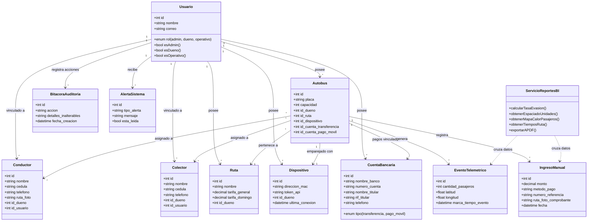
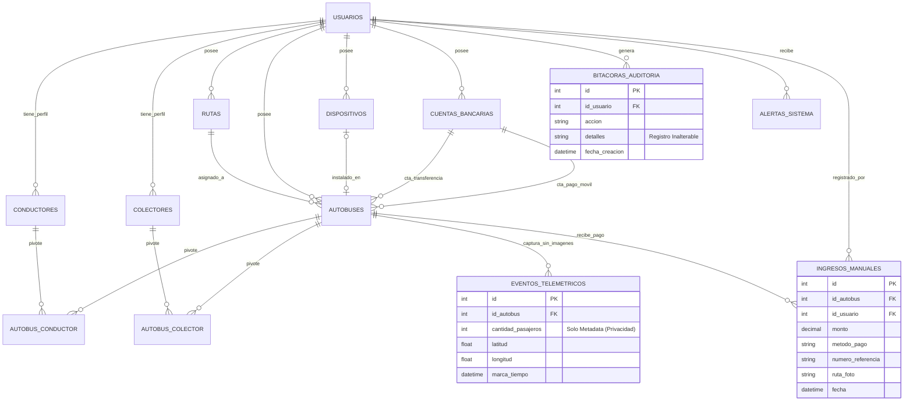
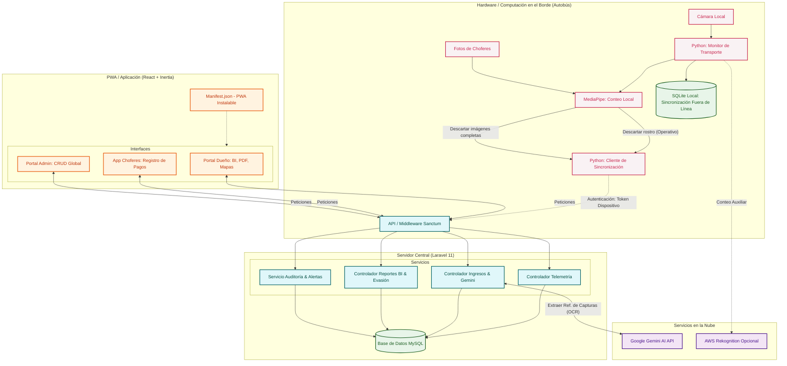
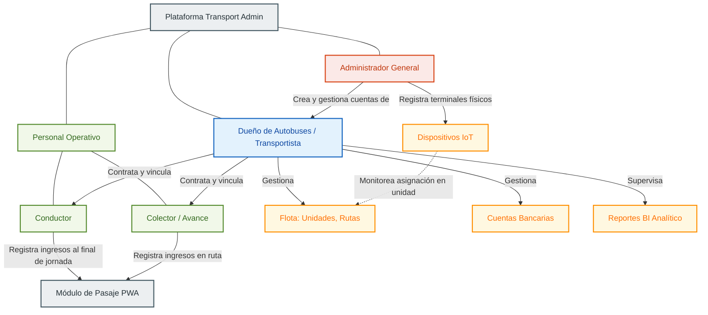
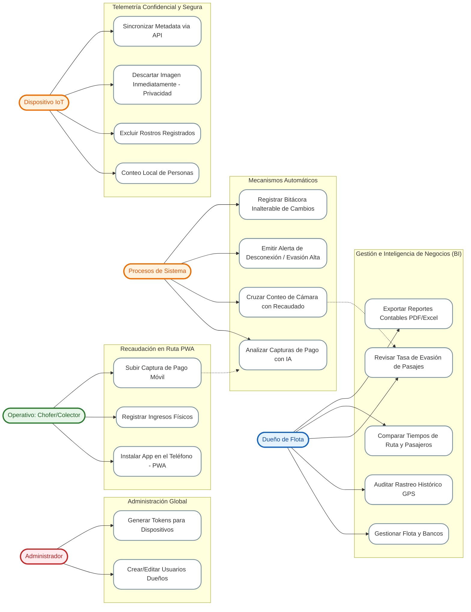
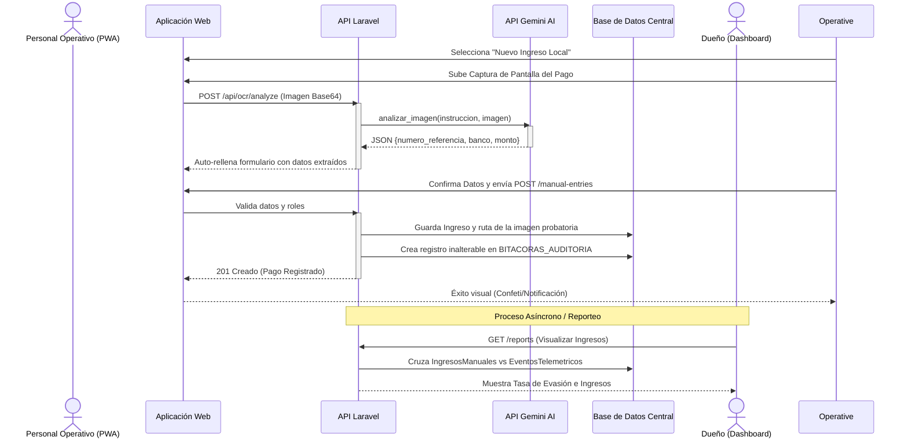
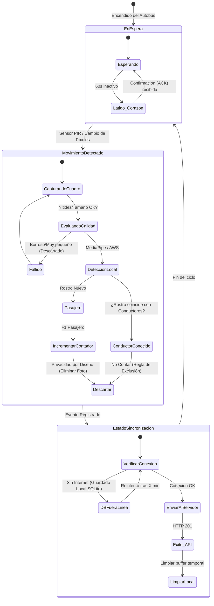
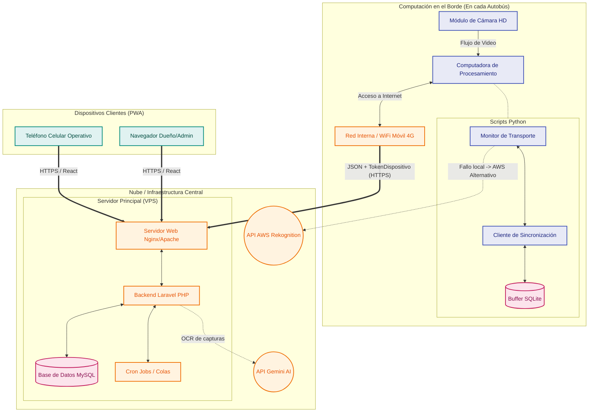
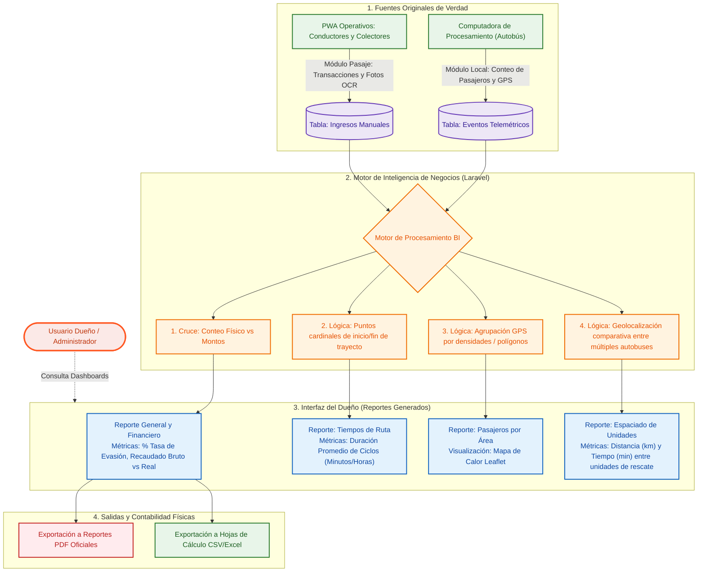

# Diagramas del Sistema - Transport Admin Completo (Español)

A continuación se encuentran los códigos **Mermaid** completos y traducidos al español para todos los diagramas del sistema. Incluyen la gestión de flotas, hardware, usuarios, ingresos manuales y las nuevas funcionalidades de Inteligencia de Negocios y Privacidad.

Puedes copiar cada bloque (solo el contenido interno) y usar la opción **Arrange > Insert > Advanced > Mermaid** en Draw.io.

## 1. diagrama_uml.drawio (Diagrama de Clases UML Completo)

**Descripción:**
Este diagrama ilustra la estructura fundamental de clases del sistema Transport Admin. Define las entidades principales (Usuarios, Flota, Gestión Financiera) y sus atributos y métodos esenciales. Destaca la implementación de POO (Programación Orientada a Objetos) dentro de la arquitectura, mostrando cómo un `Usuario` puede heredar roles específicos o asociarse con entidades de la flota como `Autobus`, `Ruta` o personal (`Conductor`, `Colector`). También introduce los bloques de servicios lógicos, como `ServicioReportesBI` (para el cálculo de evasión y reportes cruzados) y sus relaciones de dependencia con los registros de entrada (`EventoTelemetrico` e `IngresoManual`), sirviendo como plano general de la base de código.



---

## 2. diagrama_identidad_relaciones.drawio (Modelo Entidad-Relación - DER)

**Descripción:**
Este diagrama representa el diseño físico y lógico de la base de datos relacional (MySQL). Describe cómo se almacenan y vinculan los datos a través de claves foráneas (FK) y primarias (PK). Es crucial para la tesis ya que demuestra la normalización de la base de datos y la trazabilidad de la información. Se hace un énfasis especial en el bloque `EVENTOS_TELEMETRICOS`, aclarando que *solo* se almacena metadata numérica y de ubicación, sin guardar imágenes, lo que documenta el cumplimiento del requerimiento no funcional de "Privacidad por Diseño". Además, detalla las tablas pivote (ej. `AUTOBUS_CONDUCTOR`) que permiten relaciones de muchos-a-muchos en la asignación de flotas.



---

## 3. diagrama_flujos_modulos.drawio (Arquitectura y Flujo de Módulos)

**Descripción:**
Este diagrama de flujo técnico ofrece una visión macro de la arquitectura del sistema, dividiéndolo en cuatro grandes capas: Hardware IoT (Edge/Autobús), Backend (Servidor Central), Servicios Externos en la Nube y Frontend (Interfaces de Usuario). Explica visualmente el viaje de los datos: cómo el video de la cámara se procesa localmente mediante MediaPipe, cómo se descartan los rostros por privacidad, cómo el `Sync Client` transmite el conteo vía API (Sanctum) al servidor Laravel, y cómo finalmente estos datos interactúan con servicios de IA (como Gemini para OCR de pagos) antes de ser servidos a las diferentes aplicaciones cliente (PWA) de los roles correspondientes.



---

## 4. organigrama_usuarios.drawio (Jerarquía y Roles)

**Descripción:**
Este organigrama funcional detalla la jerarquía de roles (RBAC - Role-Based Access Control) implementada en el sistema y sus respectivos alcances. Muestra cómo el `Administrador General` (superusuario) gestiona a los dueños y el hardware troncal, mientras que el `Dueño` administra su ecosistema de negocio (flotas, cuentas bancarias, reportes BI, y personal). Debajo de ellos, se define la capa del `Personal Operativo` (Conductores y Colectores), cuyo alcance está estrictamente limitado a registrar transacciones al término de su jornada o en ruta a través de la PWA móvil, protegiendo así la información gerencial sensible.



---

## 5. diagrama_casos_uso_roles.drawio (Casos de Uso por Actor)

**Descripción:**
Este diagrama documenta las interacciones funcionales permitidas para cada actor dentro del sistema. A diferencia del organigrama (que muestra jerarquías), aquí se listan las acciones concretas o "Casos de Uso" que la aplicación resuelve. Se divide en cinco enfoques: las tareas de configuración del Admin, las tareas analíticas y de gestión del Dueño, el registro de ingresos del Operativo, el funcionamiento autónomo de la caja de Hardware (monitoreo de privacidad y telemetría), y finalmente, los procesos invisibles del Sistema Analítico en segundo plano (cruces de datos, OCR automatizado, y alertas por métricas anómalas).



---

## 6. diagrama_secuencia_pagos.drawio (Diagrama de Secuencia: Recaudación Inteligente con IA)

**Descripción:**
Este diagrama de secuencia traza el ciclo de vida temporal (paso a paso cronológico) de uno de los procesos más complejos: el registro de un pago asistido por Inteligencia Artificial. Ilustra cómo inicia la petición por parte del Colector en la PWA, enviando una captura de pantalla al servidor. Detalla cómo el servidor de Laravel interactúa con la API de Gemini (Google AI) para realizar un proceso iterativo de OCR, devolver los datos limpios a la vista gráfica y, tras la confirmación humana, persistir permanentemente el registro junto con una entrada inalterable en la bitácora de auditoría, para que posteriormente el dueño la consulte.



---

## 7. diagrama_estados_iot.drawio (Máquina de Estados: Hardware y Privacidad)

**Descripción:**
Esta máquina de estados modela el comportamiento interno del módulo de hardware (computación en el borde/Edge) ubicado dentro del autobús. Su objetivo es mapear por qué fases pasa el script `transport_monitor.py`. Inicia en un estado de espera (Standby) hasta que detecta movimiento, pasa a validar la calidad de la imagen, aplica detección por IA (MediaPipe) y ejecuta la regla de exclusión de rostros del personal. Es vital para demostrar la ética y privacidad tecnológica del proyecto, pues diagrama explícitamente el paso ineludible donde el evento de incremento de un pasajero es seguido inmediatamente por la destrucción local de la imagen visual antes del paso de transmisión (Sincronización).



---

## 8. diagrama_arquitectura_red.drawio (Diagrama de Despliegue / Red)

**Descripción:**
Este es un diagrama de despliegue físico y de red que ilustra cómo los componentes lógicos del software de Transport Admin se distribuyen físicamente sobre el hardware real y las topologías de conexión. Visualiza la separación estricta entre las computadoras de procesamiento aisladas dentro de los autobuses, sus dependencias locales por SQLite, su enlace saliente cifrado sobre sub-redes WiFi/4G hacia internet, y cómo aterrizan las peticiones en los servidores centrales en la nube (VPS) administrados por Nginx, finalizando en los navegadores web finales de los clientes (smartphones y PC).



---

## 9. diagrama_integracion_cv_admin.drawio (Arquitectura de Integración Visión por Computador - Gestión)

**Descripción:**
Creado específicamente para abordar el objetivo base de la tesis: la integración entre el mundo de Visión por Computadora y el Backoffice Administrativo. Este puenteo logístico detalla el ducto (pipeline) tecnológico. Del lado izquierdo (Edge), muestra la entrada del estímulo visual, extrayendo las cajas delimitadoras, pasando el algoritmo de seguimiento (Rastreador) y el contador numérico. En el medio, sitúa al Canal Seguro (Sanctum Endpoint) que funge como el traductor universal y aislador de complejidad. Del lado derecho (Nube), demuestra cómo los datos "limpios" entrantes alimentan al Motor de Inteligencia de Negocios para emparejarse con los reportes manuales, cruzando las variables para emitir reportes de evasión en tiempo real.

```mermaid
graph TD
    %% MÓDULO VISIÓN POR COMPUTADOR (EDGE)
    subgraph Modulo_CV ["Módulo de Visión por Computador (En Vehículo)"]
        direction TB
        Camara[Sensor Óptico HD] --> |Flujo de Video (Cuadros)| Detector[Motor de Detección (MediaPipe)]
        
        subgraph Logica_CV ["Procesamiento Visión por Computador"]
            Detector --> |Cajas Delimitadoras| Rastreador[Algoritmo de Rastreo (Centroides)]
            Rastreador --> FiltroCalidad{Filtro de Calidad}
            FiltroCalidad -->|Aprobado| Exclusor[Filtro de Exclusión de Personal]
            FiltroCalidad -->|Reprobado| Descarte1(Descarte)
        end
        
        Exclusor --> |Rostro Nuevo| Contador[Contador de Pasajeros]
        Exclusor --> |Chofer Reconocido| Descarte2(Descarte Visual)
        
        Contador --> CargaUtil[Generador de JSON]
        CargaUtil --> |Datos limpios: ID, GPS, Tiempo| API_Sincronizacion[Cliente REST Python]
    end

    %% CANAL DE INTEGRACIÓN
    subgraph Canal_Integracion ["Canal de Sincronización Segura"]
        API_Sincronizacion <--> |HTTPS / Token Cifrado| Sanctum[Puerta de Enlace Laravel Sanctum]
    end

    %% PLATAFORMA DE GESTIÓN ADMINISTRATIVA (NUBE)
    subgraph Plataforma_Admin ["Plataforma de Gestión Administrativa (Transport Admin)"]
        direction TB
        Sanctum --> IngestorEventos[Ingestor de Eventos]
        IngestorEventos --> DBCentral[(Base de Datos Unificada)]
        
        subgraph Logica_Negocios ["Lógica de Negocios y Finanzas"]
            DBCentral --> Conciliador[Motor de Conciliación de Pagos]
            IngresoManual[Ingresos Manuales/Digitales] --> Conciliador
            Conciliador --> Motor_BI[Motor de Inteligencia de Negocios]
        end
        
        Motor_BI --> PanelControl[Panel de Control React PWA]
        Motor_BI --> GeneradorReportes[Generador de Reportes]
        
        subgraph Salidas_Admin ["Salidas al Usuario"]
            PanelControl --> Vistas[Vistas Comparativas y Kpis]
            GeneradorReportes --> PDF_Excel(Archivos PDF/CSV)
            Vistas --> Alertas(Alertas de Evasión)
        end
    end

    %% DEPENDENCIAS CRUZADAS
    DBCentral -.-> |Descarga periódica rostros permitidos| Exclusor

    %% ESTILOS INLINE
    style Camara fill:#424242,stroke:#000000,stroke-width:2px,color:#ffffff
    
    style Detector fill:#e3f2fd,stroke:#1565c0,stroke-width:2px,color:#0d47a1
    style Rastreador fill:#e3f2fd,stroke:#1565c0,stroke-width:2px,color:#0d47a1
    style FiltroCalidad fill:#e3f2fd,stroke:#1565c0,stroke-width:2px,color:#0d47a1
    style Exclusor fill:#e3f2fd,stroke:#1565c0,stroke-width:2px,color:#0d47a1
    style Contador fill:#e3f2fd,stroke:#1565c0,stroke-width:2px,color:#0d47a1
    style CargaUtil fill:#e3f2fd,stroke:#1565c0,stroke-width:2px,color:#0d47a1

    style API_Sincronizacion fill:#fff3e0,stroke:#ef6c00,stroke-width:2px,color:#e65100

    style Sanctum fill:#fbe9e7,stroke:#ff5722,stroke-width:2px,color:#bf360c
    style IngestorEventos fill:#fbe9e7,stroke:#ff5722,stroke-width:2px,color:#bf360c
    style Conciliador fill:#fbe9e7,stroke:#ff5722,stroke-width:2px,color:#bf360c
    style IngresoManual fill:#fbe9e7,stroke:#ff5722,stroke-width:2px,color:#bf360c
    style Motor_BI fill:#fbe9e7,stroke:#ff5722,stroke-width:2px,color:#bf360c

    style DBCentral fill:#ede7f6,stroke:#673ab7,stroke-width:2px,color:#311b92

    style PanelControl fill:#e8f5e9,stroke:#4caf50,stroke-width:2px,color:#1b5e20
    style GeneradorReportes fill:#e8f5e9,stroke:#4caf50,stroke-width:2px,color:#1b5e20
    style Vistas fill:#e8f5e9,stroke:#4caf50,stroke-width:2px,color:#1b5e20
    style PDF_Excel fill:#e8f5e9,stroke:#4caf50,stroke-width:2px,color:#1b5e20
    style Alertas fill:#e8f5e9,stroke:#4caf50,stroke-width:2px,color:#1b5e20
```

---

## 10. diagrama_flujo_reportes_dueno.drawio (Flujo de Generación de Reportes BI)

**Descripción:**
Este diagrama de flujo de datos describe específicamente la procedencia y el procesamiento de la información que consume visualmente el `Dueño` en su módulo de analítica. Hace énfasis en las dos únicas fuentes de verdad u orígenes de datos: los **Ingresos Manuales/Digitales** (generados por interacciones humanas en la PWA) y los **Eventos Telemétricos** (generados silenciosamente por las cámaras de los autobuses). Muestra cómo el Motor de Inteligencia de Negocios agrupa y cruza estas fuentes inconexas para producir los cuatro reportes críticos del sistema: el cálculo de evasión general, estimación de tiempos de ruta, mapas de calor por demanda temporal, y los retardos/espaciados entre unidades de la misma línea, culminando en la exportación formal de los mismos.


